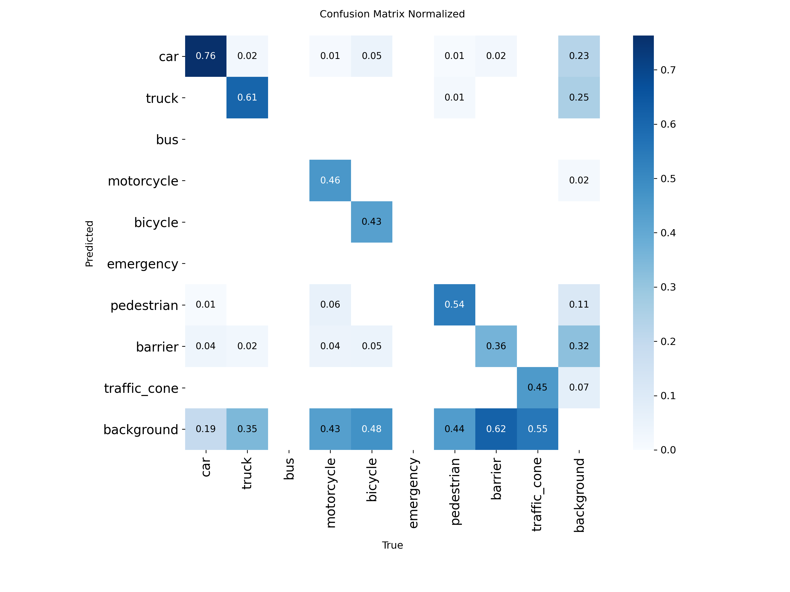
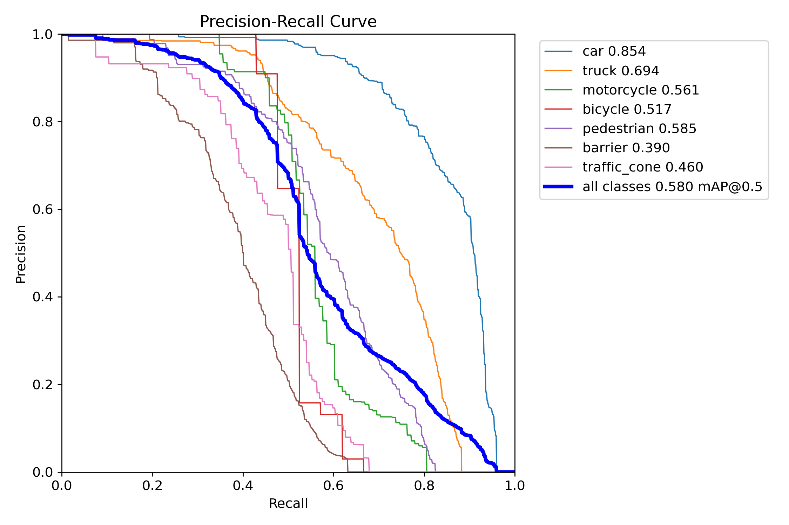
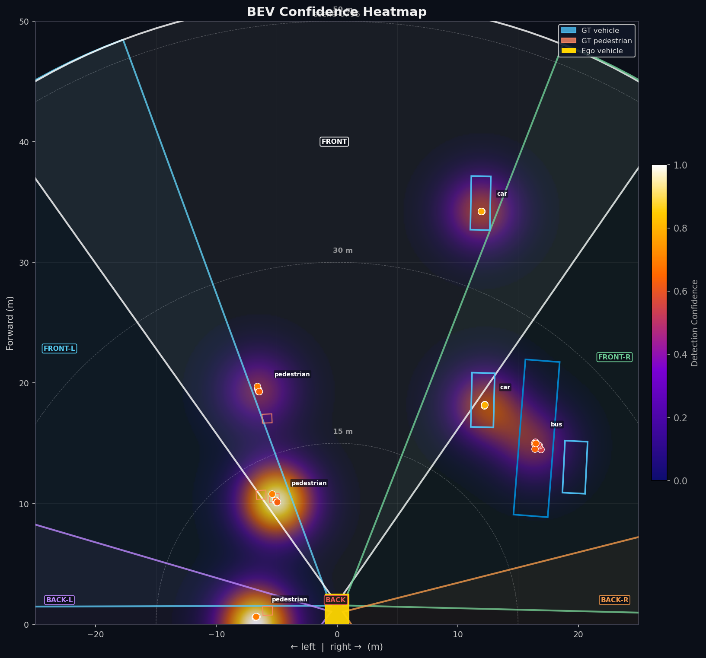

# Bird's-Eye-View (BEV) Confidence Mapping for Autonomous Driving

**Dev Jayram, Marissa Liu, Hannah Shu — Stanford University (CS231n 2026)**

---

## Abstract

Autonomous driving perception systems often report detection confidence without representing the spatial uncertainty needed for safe planning. This paper presents an uncertainty-aware perception pipeline that uses Monte Carlo DropBlock inference with YOLOv8n to estimate per-detection uncertainty and projects it into a Bird's-Eye View (BEV) confidence map using LiDAR-assisted depth back-projection. We compute a five-component uncertainty score from variation in box position, size, coordinates, confidence, and class predictions across stochastic passes, then aggregate detections onto a BEV grid through Gaussian splatting. On the nuScenes mini validation split, the deterministic YOLOv8n baseline achieves 0.337 mAP@50 and 0.175 mAP@50--95, while aggregating 20 MC-DropBlock passes recovers mAP@50 from 0.122 to 0.227. The BEV lifting stage achieves a mean localization error of 0.43 m, and removing the highest-uncertainty 25\% of detections improves mAP@50 from 0.227 to 0.289. These results suggest that the proposed uncertainty score captures meaningful detection unreliability and provides a practical spatial confidence map for risk-aware autonomous driving.

---

## Results

### Normalized Confusion Matrix


### Precision-Recall Curve


### BEV Confidence Heatmap — All Cameras, Scene 0796


### BEV Uncertainty Heatmap — Full Scene Sequence

<video src="https://raw.githubusercontent.com/devj10/cs231n/main/results/videos/bev_uncertainty_heatmap.mp4" controls width="720"></video>

*BEV uncertainty heatmap evolving over a full nuScenes scene. Warmer colors indicate higher predicted uncertainty; the heatmap updates frame-by-frame as the ego vehicle moves through the scene and new detections are lifted and splatted onto the 200×200 BEV grid.*

---

## Pipeline

```
nuScenes frame
      │
      ▼
  YOLOv8n detector  (fine-tuned on nuScenes clear-weather split)
      │  2D boxes + confidence
      ▼
  MC-DropBlock  (T=20 stochastic forward passes)
      │  per-pass boxes → pixel variance
      ▼
  lift_to_3d  ──── GT depth  (calib + ego_pose)
      │         └── LiDAR depth  (lidar_project.py → var_z)
      │  (x_m, y_m, sigma_x, sigma_y) in ego frame
      ▼
  uncertainty_to_bev  (pixel var → BEV sigma in meters)
      │  sigma_lat = (z/fx)·√var_u,  sigma_fwd = √var_z
      ▼
  splat.py  (2D Gaussian splatting onto 200×200 BEV grid)
      │
      ▼
  bev_frame.json + bev_frame.png
```

---

## File Structure

### Detection & MC Inference

| File | Description |
|------|-------------|
| `dropblock.py` | DropBlock2D layer and MC-inference toggle |
| `inject_dropblock.py` | Injects DropBlock into a YOLOv8 backbone via forward hooks |
| `mc_yolo.py` | Runs T stochastic forward passes; outputs per-pass JSON |

### BEV Pipeline (`bev/`)

| File | Description |
|------|-------------|
| `bev_grid.py` | Grid constants (200×200, 0.25 m/cell, x∈[0,50] m, y∈[−25,25] m) |
| `lift_to_3d.py` | Back-projects 2D detections to ego-frame 3D using GT or LiDAR depth |
| `lidar_project.py` | Projects LiDAR points onto image; extracts per-box depth and variance |
| `uncertainty_to_bev.py` | Converts pixel variance → BEV sigma in meters |
| `lift_adapter.py` | Batch-lifts raw dicts → `LiftedDetection` objects |
| `splat.py` | 2D Gaussian splatting onto the BEV grid |
| `run_bev.py` | Top-level conductor: lift → splat → `BevFrame` |

### Uncertainty Scoring (`uncertainty/`)

| File | Description |
|------|-------------|
| `scores.py` | Center variance, box variance, confidence variance, entropy, combined score |
| `aggregate.py` | Fuses T per-pass detections into one set of clustered detections |
| `associate.py` | Matches detections across passes via IoU |

### Evaluation (`eval/`)

| File | Description |
|------|-------------|
| `detection_metrics.py` | Standard mAP@50 / mAP@50-95 |
| `mc_detection_metrics.py` | mAP after MC-DropBlock fusion |
| `bev_metrics.py` | BEV-space localisation metrics (recall, precision, F1 by range) |

### Training & Cloud (`scripts/`, root)

| File | Description |
|------|-------------|
| `scripts/train_baseline.py` | Fine-tune YOLOv8n on nuScenes clear-weather split |
| `scripts/train_augmented.py` | Train with weather augmentation |
| `modal_train.py` | Modal app: download nuScenes from Azure, convert, train on A10G |

### Data & Config

| File | Description |
|------|-------------|
| `data/nuscenes_to_yolo.py` | Converts nuScenes 3D annotations to YOLO 2D format |
| `data/class_map.py` | 7-class mapping from nuScenes 23-category taxonomy |
| `data/dataset.yaml` | YOLO dataset config (update `path` to your local output) |
| `configs/default.yaml` | Default config for training, MC inference, BEV, and evaluation |
| `configs/augmentation.yaml` | Ultralytics and Albumentations augmentation settings |

---

## Requirements

### Full nuScenes Dataset

Training requires the full **nuScenes v1.0-trainval** dataset (~300 GB). You will not be able to run training locally without it.

- Download from [nuscenes.org](https://www.nuscenes.org/nuscenes#download) (requires free registration)
- We used the camera-only blobs (~170 GB) stored on **Azure Blob Storage** and downloaded via `azcopy` inside a Modal cloud job

### Cloud Training (Modal + Azure)

Training was run on [Modal](https://modal.com/) with an A10G GPU. You need:

1. A Modal account — `pip install modal && modal setup`
2. An Azure Blob Storage container with the nuScenes blobs and a SAS URL stored as a Modal secret named `azure-sas` with key `AZURE_CONTAINER_SAS_URL`
3. A Modal volume named `cs231n-checkpoints` for persisting the converted YOLO dataset and model checkpoint

To launch training:

```bash
modal run train_modal.py
```

The job will download nuScenes from Azure to ephemeral disk, convert to YOLO format, persist the dataset to the volume, and train. On subsequent runs it skips the download if the dataset is already on the volume.

The final checkpoint is saved to `/root/outputs/model_final.pt` on the volume and can be pulled down with:

```bash
modal volume get cs231n-checkpoints model_final.pt ./model_final.pt
```

---

## Setup (Local / Inference Only)

```bash
conda env create -f environment.yml
conda activate bev-uncertainty
```

> **Apple Silicon:** use `--device cpu` for all training/eval commands — MPS has a known bug with this Ultralytics version.

Place the pre-trained checkpoint at `model_final.pt` in the repo root (or pass `--weights` explicitly).

---

## Usage

### 1. Convert nuScenes → YOLO (requires local nuScenes data)

```bash
python data/nuscenes_to_yolo.py \
    --dataroot /path/to/nuscenes \
    --version  v1.0-trainval \
    --output   data/yolo_out \
    --val-fraction 0.1 \
    --clear-only
```

### 2. Train locally

```bash
python scripts/train_augmented.py \
    --data   data/yolo_out/dataset.yaml \
    --epochs 50 \
    --batch  8 \
    --device cpu
```

### 3. Evaluate detection mAP

```bash
python eval/detection_metrics.py \
    --weights model_final.pt \
    --data    data/yolo_out/dataset.yaml \
    --save-json results/baseline_metrics.json
```

### 4. Run MC-DropBlock inference

```bash
python mc_yolo.py \
    --weights model_final.pt \
    --source  data/yolo_out/images/val \
    --T       20 \
    --out     results/mc_raw_detections.json
```

Add `--max-images 5` for a quick smoke test.

### 5. Evaluate MC mAP

```bash
python eval/mc_detection_metrics.py \
    --mc-json results/mc_raw_detections.json \
    --fusion  union_nms
```

### 6. Run BEV pipeline (no nuScenes required)

```bash
python bev/splat.py
python bev/run_bev.py
```

## BEV Grid Spec

| Parameter | Value |
|-----------|-------|
| x (forward) | 0 – 50 m |
| y (lateral) | −25 – 25 m |
| Cell size | 0.25 m |
| Grid shape | 200 × 200 |
| Origin | ego frame (x fwd, y left, z up) |
